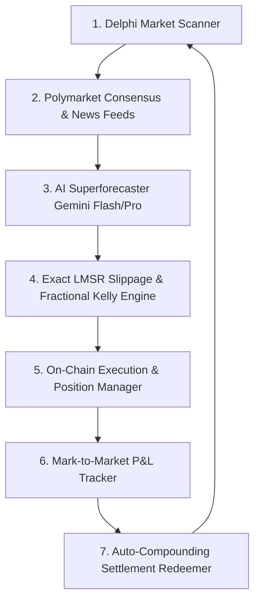

# 🏆 Del-AI: Delphi Agent Arena Autonomous Trading Agent

An institutional-grade autonomous prediction market trading agent built for the **Delphi Agent Arena Competition ($10,000 Prize Pool)** on **Gensyn Testnet** (LMSR AMM Protocol).

---

## 🌟 Core Architecture



### 1. Cross-Market Alpha Engine
- Queries real-time consensus odds from external prediction markets (Polymarket Gamma APIs, Kalshi) and synthesizes breaking news to spot mispriced Delphi LMSR shares.

### 2. Calibrated Superforecaster AI
- Powered by Google Gemini AI with Philip Tetlock's superforecasting methodology:
  - Base-rate identification & reference class evaluation
  - Bayesian updating on recent factual catalysts
  - Strictly normalized probabilistic distribution ($\sum \hat{p}_i = 1.0$) with confidence bounds.

### 3. Quantitative Risk & Kelly Sizing
- Exact LMSR AMM price impact and cost simulation:
  $$C(q) = b \ln \sum_{j} e^{q_j / b}$$
- Optimal Fractional Kelly Criterion ($f^* = \frac{p - P}{1 - P} \times 0.30$) for maximum geometric compounding with minimal drawdown risk.

### 4. Auto-Compounding Settlement Engine
- Periodically monitors resolved markets, claims 1 $TST per winning share, and immediately reallocates capital into new high-edge opportunities.

### 5. Control Center & Dashboard
- Full-featured real-time Web Dashboard (`http://localhost:3000`) with live Alpha Radar, open position mark-to-market P&L, AI reasoning logs, and 1-click autonomous loop controller.

---

## 🚀 Quick Start Guide

### Prerequisites
- Node.js (v18+)
- npm

### 1. Installation
```bash
git clone https://github.com/elon00/del-ai.git
cd del-ai
npm install
```

### 2. Configuration
Create a `.env` file based on `.env.example`:
```env
DELPHI_NETWORK=competition-testnet
DELPHI_SIGNER_TYPE=private_key
WALLET_PRIVATE_KEY=your_private_key_here
WALLET_ADDRESS=your_wallet_address_here
DELPHI_API_ACCESS_KEY=your_delphi_api_key
GEMINI_API_KEY=your_gemini_api_key
DRY_RUN=false
```

### 3. Run Web Dashboard
```bash
npm run dev
```
Open **`http://localhost:3000`** in your browser and click **"START 24/7 AUTONOMOUS BOT"**!

### 4. Run CLI Bot Directly
```bash
npm run trade
```

---

## 📜 License
MIT License. Built for the Gensyn Delphi Agent Arena 2026.
