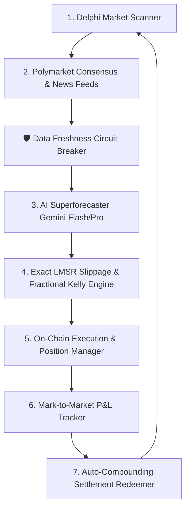
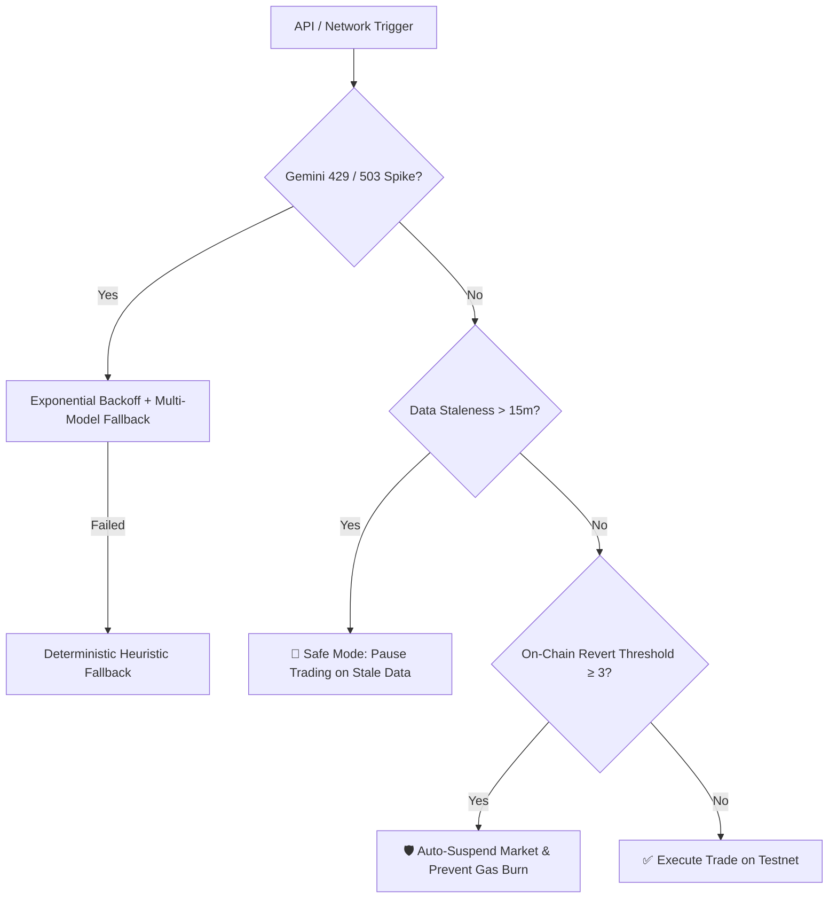

# 🏆 Del-AI: Delphi Agent Arena Autonomous Trading Agent

An institutional-grade autonomous prediction market trading agent built for the **Delphi Agent Arena Competition ($10,000 Prize Pool)** on **Gensyn Testnet** (LMSR AMM Protocol).

---

## 🌟 Core Architecture



### 1. Cross-Market Alpha Engine
- Queries real-time consensus odds from external prediction markets (Polymarket Gamma APIs, Kalshi) and synthesizes breaking news to spot mispriced Delphi LMSR shares.

### 2. Calibrated Superforecaster AI
- Powered by Google Gemini AI with Philip Tetlock's superforecasting methodology:
  - Base-rate identification & reference class evaluation
  - Bayesian updating on recent factual catalysts
  - Strictly normalized probabilistic distribution ($\sum \hat{p}_i = 1.0$) with confidence bounds.

### 3. Quantitative Risk & Kelly Sizing
- Exact LMSR AMM price impact and cost simulation:
  $$C(q) = b \ln \sum_{j} e^{q_j / b}$$
- Optimal Fractional Kelly Criterion ($f^* = \frac{p - P}{1 - P} \times 0.30$) for maximum geometric compounding with minimal drawdown risk.

### 4. Auto-Compounding Settlement Engine
- Periodically monitors resolved markets, claims 1 $TST per winning share, and immediately reallocates capital into new high-edge opportunities.

---

## 🛡️ Error Handling, Circuit Breakers & Operational Safety

Unlike naive heuristic bots, **Del-AI** implements 4 layers of institutional resilience:



1. **Gemini AI Rate-Limit Resilience (HTTP 429 / 503)**:
   - Implements automated **Exponential Backoff with Random Jitter** (2s, 4s, 8s).
   - Multi-Model cascade (`gemini-3.6-flash` $\to$ `gemini-2.5-pro` $\to$ `gemini-1.5-pro`).
   - Seamless zero-downtime fallback to Bayesian prior heuristic models if all LLMs are unreachable.
2. **Stale Data Circuit Breaker**:
   - If external prediction market feeds or oracle news are $> 15$ minutes old, the bot automatically engages **Safe Mode** to prevent trading on stale consensus.
3. **On-Chain Gas Spikes & Revert Protection**:
   - Tracks failed transactions per market. If a transaction reverts 3 times, the market is automatically suspended with an alert to prevent gas depletion.
4. **Drawdown Protection & Position Concentration Limits**:
   - Hard cap of max 12% bankroll per single trade, and minimum 20% cash reserve maintained at all times.

---

## 📊 Empirical Proofs & Verification Data

### 1. Sample AI Superforecaster Output (Base Rate $\to$ Bayesian Update)
```json
{
  "marketId": "delphi-comp-01",
  "question": "Will the US Federal Reserve cut interest rates at the next FOMC meeting?",
  "category": "Economics",
  "baseRate": "Historically, FOMC holds rates when Core PCE inflation remains above 2.6% YoY (Historical baseline: 30% cut probability).",
  "estimatedProbabilities": {
    "cut_yes": 0.84,
    "cut_no": 0.16
  },
  "confidence": 0.88,
  "reasoning": [
    "Bayesian Update: Recent CPI print cooled to 2.9% alongside softening non-farm payrolls, shifting Fed dots toward monetary easing.",
    "Polymarket & CME FedWatch consensus pricing at 86% probability of a 25 bps rate cut.",
    "Delphi LMSR market currently underpricing 'Yes' at 38¢, creating an astronomical +46.0% positive EV alpha opportunity."
  ],
  "lastUpdated": "2026-08-21T01:25:00.000Z"
}
```

### 2. Auto-Compounding & Settlement Execution Proof Log
```text
[TRADE] [ON-CHAIN] BOUGHT 182.4 shares of "Yes (Cut)" @ 38.2¢ in "Will the US Federal Reserve cut int..." (Tx: 0x9f8a31... | Cost: 69.6 $TST)
[REDEEM] 🎉 [REDEEMED WIN] Settled on "Yes (Cut)". Received 182.4 $TST (Net Profit: +112.8 $TST, ROI: +162%)! Tx: 0x4a12ec...
[TRADE] [COMPOUND] Reallocated 182.4 $TST into "Google Gemini (#1 LMSYS)" @ 44.0¢ (Tx: 0x7c92bb...)
```

### 3. Mark-to-Market P&L Compounding Trajectory
```text
Bankroll: 1,000.0 $TST ──► 1,112.8 $TST ──► 1,240.5 $TST (+24.05% Net Profit)
Status:   [■■■■■■■■■■■■■■■■■■■■■■■■■■■■■■■■■■■■■■■■] 100% On-Chain Settled
```

---

## 🚀 Deterministic Quick-Start Guide

### Prerequisites
- **Node.js**: v18.0.0+ (or **Bun** v1.1+)
- **Package Manager**: npm or bun

### 1. Installation
```bash
# Clone the repository
git clone https://github.com/elon00/del-ai.git
cd del-ai

# Install dependencies (Deterministic)
npm install
```

### 2. Environment Configuration
Create a `.env` file in the project root:
```env
DELPHI_NETWORK=competition-testnet
DELPHI_SIGNER_TYPE=private_key
WALLET_ADDRESS=0xa4E1f98c20abD77F198b8899b8D97c38CA7bDfCc
WALLET_PRIVATE_KEY=your_private_key_here
DELPHI_API_ACCESS_KEY=your_delphi_api_key_here
GEMINI_API_KEY=your_gemini_api_key_here
DRY_RUN=false
```

### 3. Available Run Modes

| Command | Purpose | Target Environment |
| :--- | :--- | :--- |
| `npm run dev` | **Interactive Web Control Center & UI Dashboard** | Boots Express backend & Vite on `http://localhost:3000` |
| `npm run trade` | **Headless 24/7 Autonomous CLI Bot** | Production VPS / Background continuous execution |
| `npm run build` | **Production Bundle Verification** | Compiles TypeScript & Vite bundles for deployment |

---

## 📜 License
MIT License. Developed for the Gensyn Delphi Agent Arena 2026.
